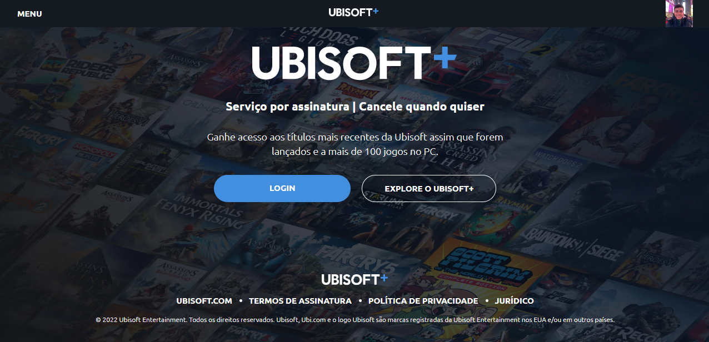

# Ubisoft+ Clone 

A responsive clone of Ubisoft+ main page, made with HTML, CSS and JavaScript.

A complex project that made me improve positions and display in CSS, practice JavaScript and learn more about responsiveness.

# Final Result 🔥 

 

## Starting 

To start the project, just open the file `index.html` in your preferred browser...

To open the project right now, click on the link: https://matheuslopesmdev.github.io/ubisoft-clone/

--- 

##### Make with 🧠 by Matheus Lopes.
